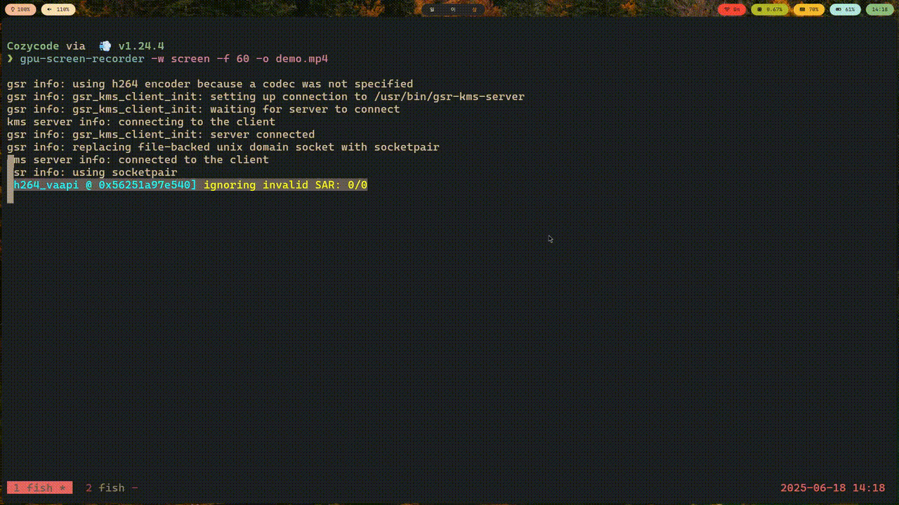

# Cozycode

A powerful, fast, and extensible coding agent built in Go that runs entirely in your terminal. Designed for developers who prefer a minimal, focused environment, this tool helps you write, edit, and reason about code interactively with an AI assistant — all from the comfort of your terminal.



This project combines the speed and simplicity of native Go with the flexibility of modern AI tooling, delivering an experience optimized for local development workflows.

## Core features (Curr. in dev mode)

- Terminal-Native TUI: Built with Go and a terminal UI library for a smooth, responsive developer experience — no Electron, no overhead.

- Multi-Model Support: Works with various LLM APIs (OpenAI, Anthropic, Local LLMs via Ollama, etc.). Easily extendable to support more.

- Code Understanding & Editing: Ask questions, generate code, refactor, or document snippets. The agent understands and operates on your codebase contextually.

- File System Access (Safeguarded): The agent can read project files, search code, and write suggestions — with sandboxing and scoped access to prevent destructive actions.

- Safe Command Execution: Run generated shell, Python, or other scripts in a controlled environment — optionally in Docker, WASM, or a VM sandbox.

- Extensible Tooling: Plug in your own terminal tools (e.g., grep, rg, go test, make) for use within agent workflows.

- Context Management: Intelligent summarization and compaction keeps prompt contexts efficient while preserving key information.

## To Run This

1. Install [Golang](https://go.dev/doc/install)
2. Install [Task](https://taskfile.dev/installation/)

- Create an temporary alias for task

```sh
alias task='go-task'
```

- Get inside the cloned directory and Run Directly

```bash
go run cmd/*.go
```

- Or Run via Taskfile
```bash
task
```

